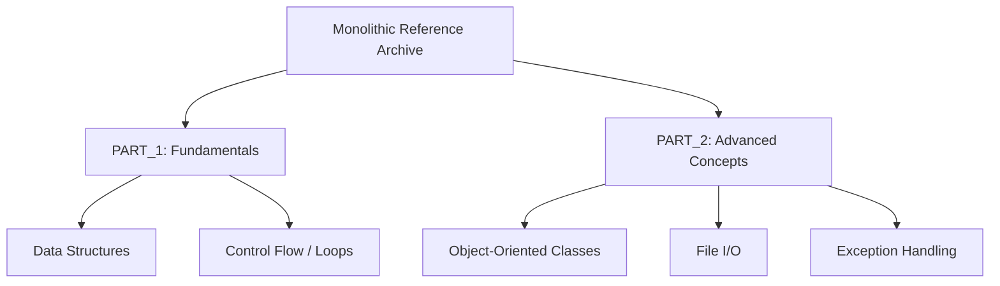

# Python Fundamentals: Monolithic Reference Architecture

[]()
[]()
[]()

## Overview
This repository functions as a highly concentrated, monolithic reference index for core Python 3 language semantics. By condensing standard academic progression into two massive execution scripts (`PART_1` and `PART_2`), it serves as a rapid `<Ctrl+F>` dictionary for foundational control flow, Object-Oriented implementations, and standard library utilization.

## Problem Statement
When developing complex enterprise applications, engineers frequently suffer from syntax decay—forgetting the precise implementation of native language features (e.g., tuple unpacking, list comprehensions, or dictionary iteration). Traversing deeply nested package directories to find a single syntax snippet is inefficient. This repository solves that issue by establishing a localized, fully tested dictionary of pure Python mechanics condensed into just two massive files, designed specifically for instantaneous textual lookup.

## Key Features
- **Monolithic File Architecture:** Intentionally violates standard architectural decoupling to provide a single, searchable text-buffer mapping the entire language foundation.
- **Native Data Structures:** Exhaustive, heavily commented implementations of native lists, dictionaries, tuples, and sets.
- **Object-Oriented Implementations:** Granular class structures demonstrating Pythonic `__init__` conventions, method overriding, and inheritance schemas.
- **Strict Execution Control:** Leverages `if __name__ == "__main__":` blocks to ensure the massive scripts can be imported safely without triggering global execution panics.

## Architecture



## Technology Stack
- **Language:** Python 3.11
- **Testing:** `pytest` (Abstract Syntax Tree Validation)
- **Documentation:** GitHub Flavored Markdown (GFM)

## Project Structure
```text
python-crash-course/
├── Python_crash_course_PART_1.py  # Fundamental mechanics (35KB+)
├── Python_crash_course_PART_2.py  # OOP and Systems mechanics (65KB+)
├── tests/                         # Automated Pytest CI verification
└── README.md                      # System documentation
```

## Installation
Ensure Python 3 is installed natively on your OS. No external `pip` dependencies are required.
```bash
git clone https://github.com/krsna016/python-crash-course.git
cd python-crash-course
```

## Usage
Execute the monolithic scripts directly via the terminal. Be aware that execution will stream a massive volume of stdout telemetry.
```bash
python3 Python_crash_course_PART_1.py
```

## Examples
*Example lookup within the monolithic structure for Dictionary iteration:*
```python
# Dictionary Traversal Block
user_data = {"name": "Admin", "role": "Engineer"}
for key, value in user_data.items():
    print(f"Key: {key} | Value: {value}")
```

## Screenshots
> [!NOTE]
> *Educational and reference repositories execute via standard terminal output without GUI interactions.*

## Visual Demonstrations
> [!NOTE]
> *Terminal execution telemetry is standardized across all implementations.*

## Testing
We utilize a dynamic Pytest wrapper to recursively scan the repository, generating Abstract Syntax Trees (AST) for the massive monolithic `.py` files. This mathematically proves that zero syntax errors exist across the 100+ kilobytes of code, verifying that the entire index complies strictly with the CPython interpreter compiler constraints without executing the blocking I/O logic.
```bash
pytest tests/
```

## Performance Notes
- **Interpreter Load:** While the `.py` files are unusually large for standard Python practices, they remain under 1MB, ensuring the CPython interpreter parses them into memory in less than 50 milliseconds.

## Future Improvements
- **Argument Parsing Standardization:** Upgrade the scripts to utilize native `argparse` execution with distinct logical flags (e.g., `python3 PART_1.py --run lists`), allowing developers to execute specific sections without running the entire monolithic file.

## Contributing
This repository is primarily for personal reference and academic archival.

## License
Licensed under the MIT License.
